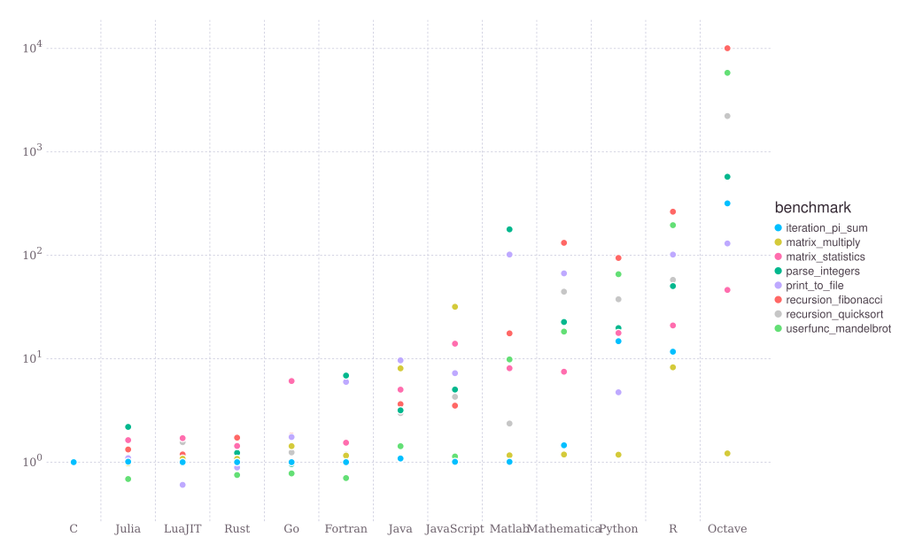

# Introduction

Fredrik Ekre, f.ekre@tu-braunschweig.de

## What is Julia?

Julia is:
- a programming language (like C, C++, Python, ...)
- free and open source (MIT license)
- relatively new, first public in 2012, version 1.0 in 2018 (C 1972, C++ 1985, Python
  1992)
- general (scientific computing, web applications, machine learning, ...)
- dynamic and high-level (like Python)
- fast (like C/C++) by compiling to native code using the LLVM compiler infrastructure
- transparent; most of Julia is written in Julia
- fun!

### Micro benchmarks



### Two language problem

One motivation for Julia is to solve the "two language problem" where you prototype in a
high-level language (like Python), re-write "final" code in a low level language (like C,
C++) for performance. With Julia you can do both.

### Useful resources

- [Julia project homepage](https://julialang.org)
- [GitHub repository](https://github.com/JuliaLang/julia)
- [Documentation](https://docs.julialang.org)
- [Discussion forum](https://discourse.julialang.org)
- Chat forums:
   - [Slack](https://julialang.org/slack/)
   - [Zulip](https://julialang.zulipchat.com/)

## Julia syntax crash course

### Number types

Manual section: https://docs.julialang.org/en/v1/manual/integers-and-floating-point-numbers/

#### Integers

Literal integer (64-bit)

````julia
123
````

The typeof function return the type of the input argument

````julia
typeof(123)
````

#### Floats

Literal Float64 (double precision, 64-bit)

````julia
123.0
````

Scientific notation

````julia
456e7 # 456.0 * 10^7
````

Literal Float32 (single precision, 32-bit)

````julia
456f7
````

#### Complex numbers

Imaginary number spelled `im` in Julia.

ComplexF64 (complex number with Float64 for both real and imaginary components)

````julia
z = 2.0 + 4.0 * im
````

````julia
typeof(z)
````

Implicit multiplication with variables, im in this case

````julia
2 + 3im # 2 + 3 * im
````

#### Rational numbers

````julia
6 // 8
````

#### Irrational numbers

Irrational constant which is "exact" (rounded appropriately for the context
where it is used)

````julia
pi
````

Multiplication with integer returns Float64

````julia
typeof(2 * pi) # Int64 * Irrational -> Float64
````

Unicode variable names

````julia
π # \pi<TAB> in most editors
````

### Variables

Manual section: https://docs.julialang.org/en/v1/manual/variables/

````julia
a = 123
b = 456.0
````

Unicode variable sometimes helps with readability when implementing
mathematical formulas

````julia
τ = 2pi
````

### Arithmetic operations
Manual section: https://docs.julialang.org/en/v1/manual/mathematical-operations/

Mathematical operators and functions work as expected. Julia is smart with
promoting the types of the arguments to a common type before computing the
result.

````julia
123 + 456 # Int64 + Int64 -> Int64
````

````julia
123e2 - 456f2 # Float64 - Float32 -> Float64
````

````julia
123 * 456 # Int64 * Int64 -> Int64
````

````julia
123 / 456 # Int64 / Int64 -> Float64
````

````julia
0.987 ^ 3
````

````julia
√(2) # \sqrt<TAB>, alternatively: sqrt(2)
````

Integer division

````julia
456 ÷ 123 # \div<TAB>, alternatively: div(456, 123)
````

### Arrays

Manual section: https://docs.julialang.org/en/v1/manual/arrays/

Julia has built in support for multi-dimensional arrays. There are also many
other implementations of arrays for different purposes and with different
properties.

#### Vectors (1D-arrays)

````julia
x = [1, 2, 3]
````

The eltype function returns the type of the elements of the array

````julia
eltype(x)
````

Vector of length 5 initialized with zeros (Float64)

````julia
zeros(5)
````

Zero-initialized vector with specified element type

````julia
x = zeros(Int, 5)
````

#### Matrices (2D-arrays)

````julia
[1 2; 3 4]
````

`rand` can be used to sample values randomly in the interval [0, 1)

````julia
rand(3, 2)
````

#### Higher dimensional arrays

````julia
rand(2, 3, 4, 5, 6)
````

#### Indexing

Square brackets [] are used to index into arrays. The default array
implementation is 1-based and column-major ("first index moves fastest").

````julia
x = rand(3)
````

````julia
x[1]
````

````julia
x[2] + x[3]
````

Multi-dimensional arrays are indexed with one index per dimension

````julia
A = [1 3 5; 2 4 6]
````

````julia
A[1, 2] # row 1, col 2
````

Slicing arrays with : (colon) selects all columns/rows/...

````julia
A[:, 2] # all rows, column 2
````

````julia
A[2, :] # row 2, all columns
````

Selecting multiple entries

````julia
A[[2, 1], 2] # rows 2 and 1 (in that order!), column 2
````

Indexing returns a newly allocated array -- modifying the result does *not*
modify the original array.

Julia also has array views that can be used to i) avoid the allocation of a
new array and ii) modify the original array memory.

````julia
row2 = view(A, 2, :)
````

````julia
typeof(row2)
````

Modify the view

````julia
row2[2] = 123
````

Verify that A is now also changed

````julia
A
````

There is also a *macro* to make view-syntax a bit easier. Macros rewrite
expressions to another expression before it is evalutated. Macros in Julia
starts with @.

````julia
@view A[2, :] # Rewritten to view(A, 2, :)
````

### map, reduce, mapreduce

````julia
x = [1.0, 2.0, 3.0]
````

````julia
sum(x)
````

````julia
reduce(+, x)
````

````julia
reduce(*, x)
````

````julia
map(sqrt, x)
````

````julia
mapreduce(sqrt, +, x) # reduce(+, map(sqrt, x)) but in one step
````

Broadcasting

"Element wise application of functions with automatic reshaping".
Broadcasting is done using . (dot) for functions and operators. Works for
*any* function, including user functions.

In this example we broadcast `+` between a vector (x) and a number (y). This
will add the number to all entries of the vector. The number is virtually
extended to the same size as x.

````julia
y = rand()
x .+ y
````

Broadcasting between two vectors of the same length also work (although this
is an operation that make sense also for the regular `+` operator -- adding
vectors is rather common concept after all).

````julia
y = rand(length(x))
x .+ y
````

````julia
x + y
````

Here we add a vector of size (3,) with a matrix of size (3, 4). The vector is
extended 4 times in the second dimension to also have (virtual) size (3, 4).

````julia
y = rand(length(x), 4)
x .+ y
````

### Linear algebra

Manual section: https://docs.julialang.org/en/v1/stdlib/LinearAlgebra/

Julia has built-in linear algebra support which utilizes LAPACK and OpenBLAS
(by default).

````julia
using LinearAlgebra

A = rand(2, 2)
b = rand(2)
````

Matrix-vector multiplication

````julia
A * b
````

Solving linear system Ax = b (using LU factorization by default)

````julia
A \ b
````

### Strings

````julia
str = "Hello, Tampere"
````

````julia
println(str) # println = print + newline
````

Joining strings is done with * (or the string function)

````julia
str2 = str * "!"
````

Lots of string functions (searching, replacing, regex support, ...)

````julia
str3 = replace(str2, "Tampere" => "Tammerfors")
````

String interpolation using $(...) replaces with string representation of the
... expression

````julia
name = "Fredrik"
str = "Hello $(name)"
````

````julia
x = [1, 2, 3]
str = "x = $(x)"
````

````julia
str = "Random number: $(rand())"
````

### Functions

Functions in Julia are defined with the keyword `function`:

````julia
function f()
    return sqrt(2)
end
f()
````

For "one-liners" there is also a shorter syntax:

````julia
g() = sin(pi)
g()
````

The `return` keyword is optional, but for clarity it is usually preferred. If
there is no `return` statement in a function the value of the last expression
will be returned. In the example below `sqrt(2)` is the last expression or
statement and will be the return value.

````julia
function f2()
    x = 2
    sqrt(x)
end
````

Functions can have *positional* and *keyword* (named) arguments. Typically
keyword arguments are used for optional arguments and therefore often have
default values. Keyword arguments are separated by using ; (semi-colon)
instead of , (comma) in the argument list.

Here is a function with two positional arguments (x and y) and a keyword
argument `verbose` with default value `false`.

````julia
function h(x, y; verbose=false)
    z = x * y
    if verbose
        println("I computed $(x) * $(y) and will return $(z)")
    end
    return z
end

h(2, 3)
h(2, 3; verbose = false)
h(2, 3; verbose = true)
````

Functions can return multiple values: `findmax` return the value, and the index

````julia
x = [4, 5, 1]
val, idx = findmax(x)
````

Functions that don't have anything useful to return usually return `nothing`.

````julia
x = println("hello")
typeof(x)
````

#### Anonymous functions
Julia also support anonymous functions which is useful when you construct a
function "on the fly". Anonymous functions are defined using `->`, or using the `function` keyword without a name:

````julia
ff = x -> x^2

gg = function(x)
    return x^2
end
````

Common use case is to pass to higher order functions like `map`:

````julia
x = [1, 2, 3]
map(x -> x^2, x)
````

### Structs (user defined types)

Manual section: https://docs.julialang.org/en/v1/manual/types/#Composite-Types

Structs are used to collect data. A typical example could be simulation
parameters. By convention structs (and types in general) use PascalCase. In
this example we define a struct called `SimulationParameters` wich a field
`a` of type `Int`, and field `b` of type `String`:

````julia
struct SimulationParameters
    a::Int
    b::String
end
````

We can construct an instance of this new struct by using the (default)
constructor which simply takes two arguments: a and b.

````julia
s = SimulationParameters(1, "hello")
````

Unpacking the elements:

````julia
s.a
s.b
````

Structs are mutable by default so it is not possible to change the data after construction. If this is a requirement there are mutable structs:

````julia
mutable struct MutableSimulationParameters
    a::Int
    b::String
end

m = MutableSimulationParameters(2, "hi")
````

Update field `a`:

````julia
m.a = 3
````

Verify that it has changed

````julia
m.a
````

Structs can be parametric. The parameter is a placeholder. In the example
below we implement a new struct called `MyComplex` which has one template
parameter `T`. Both the real and imaginary parts have type `T`. The value of
`T` can be anything and is determined once an instance of the struct is
created.

````julia
struct MyComplex{T}
    real::T
    imag::T
end
````

We can now construct a `MyComplex{Int}` by passing two values of type `Int`

````julia
MyComplex(1, 2)
````

But we can also construct a `MyComplex{String}` by passing two strings...

````julia
MyComplex("one", "two")
````

It is possible to enforce certain relations between the parameters. For
example, if we only want to allow `T` that are subtypes of `Real` (basically
all real-valued number types such as `Float64`, `Int`, ...) we can use the
subtype operator in the definition of the struct:

````julia
struct MyImprovedComplex{T <: Real}
    real::T
    imag::T
end
````

These now work as expected:

````julia
MyImprovedComplex(1, 2)
MyImprovedComplex(1.0, 2.0)
````

But this will fail, since `String <: Real` is false:

````julia
MyImprovedComplex("one", "two")
````

### Loop constructs and control flow

TODO: Link

`for`-loops can be used to iterate over iterables, such as the range 1:n in
the following example:

````julia
function say_hi(n)
    for i in 1:n # loop from 1 to n in steps of 1
        println("Hi, n = $i")
    end
end

say_hi(3)
````

`while`-loops run until the condition is false.

````julia
function say_hi_while(n)
    i = 1
    while i <= n
        println("Hi, n = $i")
        i += 1
    end
end

say_hi_while(2)
````

To exit a loop early one can use `break`

````julia
while true
    println("infinite loop!")
    break
end
````

