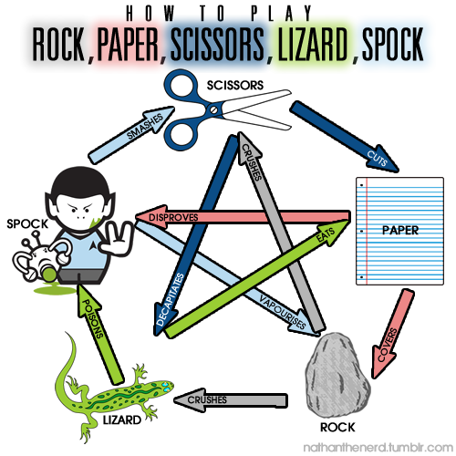

````julia
using InteractiveUtils
````

# Multiple dispatch

## Functions and Methods

Functions in Julia can have multiple *methods*. See for example the methods
for the multiplication function *:

````julia
methods(*)
````

All these methods correspond to different implementations of *, for different
argument type combinations. Julia dispatches based on the input types. The
`@which` macro can be used to inspect which method will be called:

````julia
@which 2.0 * 4.0
````

````julia
@which 2 * 4
````

We can implement a function `fn` with several methods:

````julia
function fn(x::Int, y::Int)
    println("Int and Int")
end

function fn(x::Float64, y::Float64)
    println("Float64 and Float64")
end

function fn(x::Int, y::Float64)
    println("Int and Float64")
end

function fn(x::Float64, y::Int)
    println("Float64 and Int")
end
````

We can now call function fn and see which of the 4 methods is actually called:

````julia
fn(1, 2)
````

````julia
fn(1.0, 2.0)
````

````julia
fn(1, 2.0)
````

````julia
fn(1.0, 2)
````

Trying to `fn` with any other combination of types will error:

````julia
fn("hello", 2)
````

Skipping types in the function signatures is equivalent to using `::Any`. We
can use this to define a catch-all method of `fn`:

````julia
function fn(x, y) # equivalent to fn(x::Any, y::Any)
    println("Any and Any (but really $(typeof(x)) and $(typeof(y)))")
end
````

Now we can call `fn` with a String and an Vector, for example

````julia
fn("hello", [1, 2, 3])
````

## More on types

In the example above we used the type `Any`. `Any` is the *supertype* of all
types. The subtype operator, `<:`, can be used to verify this:

````julia
Int <: Any
````

````julia
String <: Any
````

However, `Any` isn't the only supertype in the hierarchy. The `supertype`
function return the immediate supertype (i.e. the types "parent"), and the
`supertypes` function return *all* supertypes:

````julia
supertype(Int)
````

````julia
supertypes(Int)
````

````julia
supertypes(Float64)
````

`Real` is a common ancestor of *both* `Int` and `Float64`. What happens if we
throw some methods with `Real` into the mix:

````julia
function fn(x::Real, y::Int)
    println("Real and Int (but really $(typeof(x)) and $(typeof(y)))")
end
````

If we again try to call `fn` with two `Int`s there are two candidate methods:

 - `fn(::Int,  ::Int)`
 - `fn(::Real, ::Int)`

Which one will be picked?

````julia
fn(1, 2)
````

Julia picks *the most specific* method: in this case `Int` is more specific
than `Real`.

There isn't always a most-specific method to pick. Consider for example
`fn2`, with two methods:

````julia
fn2(x::Int, y::Real) = 1
fn2(x::Real, y::Int) = 2

fn2(1, 2)
````

Supertypes, sometimes called *abstract* types, can not have instances, they
only exist in the type hierarchy, i.e., there is no `x` for which `typeof(x)`
return a abstract type.

## Methods with abstract types

Methods or functions can often be written in a generic way that works for
many different subtypes. For example, to sum all the elements in a vector we
only need to be able to iterate it. Thus, the example below is applicable to
*all* subtypes of `AbstractVector`, not just the built in `Vector` type.

````julia
function vecsum(x::AbstractVector)
    s = zero(eltype(x))
    for xi in x
        s += xi # Equivalent to z = z + xi.
    end
    return s
end
````

We can now sum a Vector{Int}

````julia
vecsum([1, 2, 3])
````

and a Vector{Float64}

````julia
vecsum([1.0, 2.0, 3.0])
````

or even a vector view of a matrix

````julia
A = [1 2; 3 4]
````

````julia
vecview = @view A[2, :]
````

````julia
typeof(vecview)
````

````julia
typeof(vecview) <: AbstractVector
````

````julia
vecview isa AbstractVector
````

````julia
vecsum(vecview)
````

However, perhaps we should have limited the element type to be `<: Number`,
because the following should probably not be allowed (it will still error,
but later in the process):

````julia
vecsum(["one", "two"])
````

This could have been done by using the signature
`vecsum(x::AbstractVector{T}) where {T <: Number}` for example.

## Rock, paper, scissors

Let's implement a game using multiple dispatch!

All weapons will have the supertype `Weapon`

````julia
abstract type Weapon end
````

And all weapons should implement a method of the function `stat`. We declare
an empty function (no methods) for now.

````julia
function stat end
````

We can now implement the first weapon

````julia
struct Rock <: Weapon
    hardness::Float64
end
````

Rock constructor. We define a new constructor with zero arguments that
generate a random hardness.

````julia
function Rock()
    hardness = rand()
    return Rock(hardness)
end
````

We also define the required `stat` method to return the hardness

````julia
function stat(r::Rock)
    return r.hardness
end
````

The implementations of `Paper` and `Scissors` follow the same pattern:

````julia
struct Paper <: Weapon
    thickness::Float64
end
function Paper()
    thickness = rand()
    return Paper(thickness)
end
function stat(p::Paper)
    return p.thickness
end

struct Scissors <: Weapon
    sharpness::Float64
end
function Scissors()
    sharpness = rand()
    return Scissors(sharpness)
end
function stat(s::Scissors)
    return s.sharpness
end
````

We now have to implement the interactions between the weapons. We do this by
implementing methods of a function called `fight`.

We now know how to implement methods for abstract types, so we can start by
defining a fallback method to catch any errors. This method will be called
unless there are any more specific matching methods of the `fight` function.

````julia
function fight(w1::Weapon, w2::Weapon)
    error("I do not know who wins in a fight between $(typeof(w1)) and $(typeof(w2)) :(")
end
````

We can try it already

````julia
fight(Rock(), Paper())
````

Now lets implement the interactions. We let each `fight` method return 1 if
the first weapon wins and 2 if the second weapon wins. We start by
implementing a method for when the same weapon meets the same weapon. We can
write a generic method for this, because all weapons implement the `stat`
function. Note that the method signature is different from the fallback since
we here require *both* arguments to be of the *same* type (`W` can not mean
two different things).

````julia
function fight(w1::W, w2::W) where {W <: Weapon}
    if stat(w1) >= stat(w2)
        return 1
    else
        return 2
    end
end
````

Now we just need to implement the remaining methods

Rock vs Paper: Paper wins!

````julia
fight(r::Rock, p::Paper) = 2
fight(p::Paper, r::Rock) = 1
````

Rock vs Scissors: Rock wins!

````julia
fight(r::Rock, s::Scissors) = 1
fight(s::Scissors, r::Rock) = 2
````

Paper vs Scissors: Scissors wins!

````julia
fight(p::Paper, s::Scissors) = 2
fight(s::Scissors, p::Paper) = 1
````

To help play the game we define a function to return a random weapon:

````julia
function random_weapon()
    r = rand(1:3)
    if r == 1
        return Rock()
    elseif r == 2
        return Paper()
    else # r == 3
        return Scissors()
    end
end
````

Finally our main function, `game`, which plays `n_rounds` and prints out the winner

````julia
function game(n_rounds)
    # Initialize players score
    player1_score = 0
    player2_score = 0
    # Loop n_rounds times
    for _ in 1:n_rounds
        # Draw random weapons for each player
        w1 = random_weapon()
        w2 = random_weapon()
        # Fight: compute the winner
        winner = fight(w1, w2)
        # Keep track of the scores
        if winner == 1
            player1_score += 1
        elseif winner == 2
            player2_score += 1
        else
            # Defensive programming; `fight` should never return anything but 1
            # or 2, but you never know...
            error("how did this happen?")
        end
    end
    # Print out the score and the winner
    winner = player1_score >= player2_score ? 1 : 2
    println("Final scores:")
    println(" - Player 1: $(player1_score)")
    println(" - Player 2: $(player2_score)")
    println("Player $winner wins the game!")
    return nothing
end
````

Play the game!

````julia
game(1000)
````

### Exercise

Extend the game in some way! For example make it so that fights, and the
game, can end in a draw, or implement Rock, Paper, Scissors, Lizard, Spock by
implementing two more weapons.




